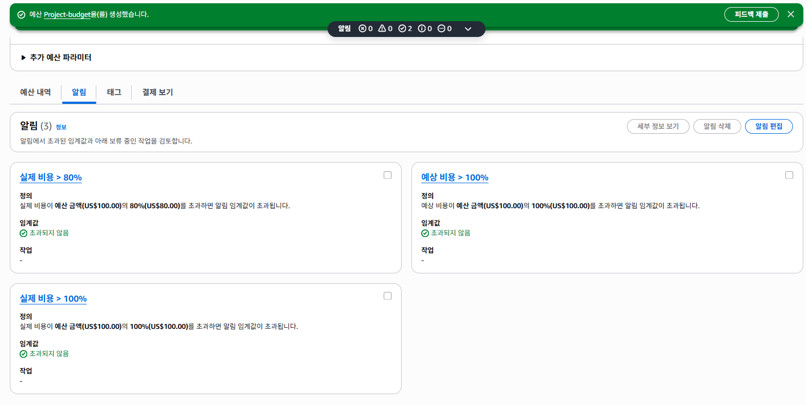
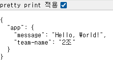
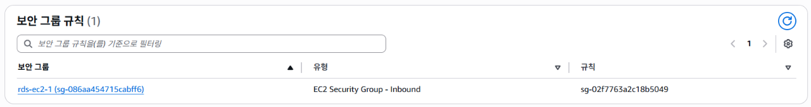
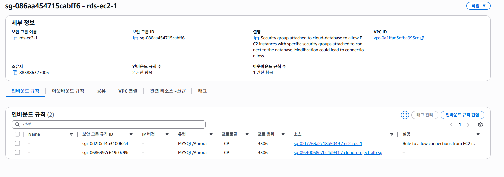
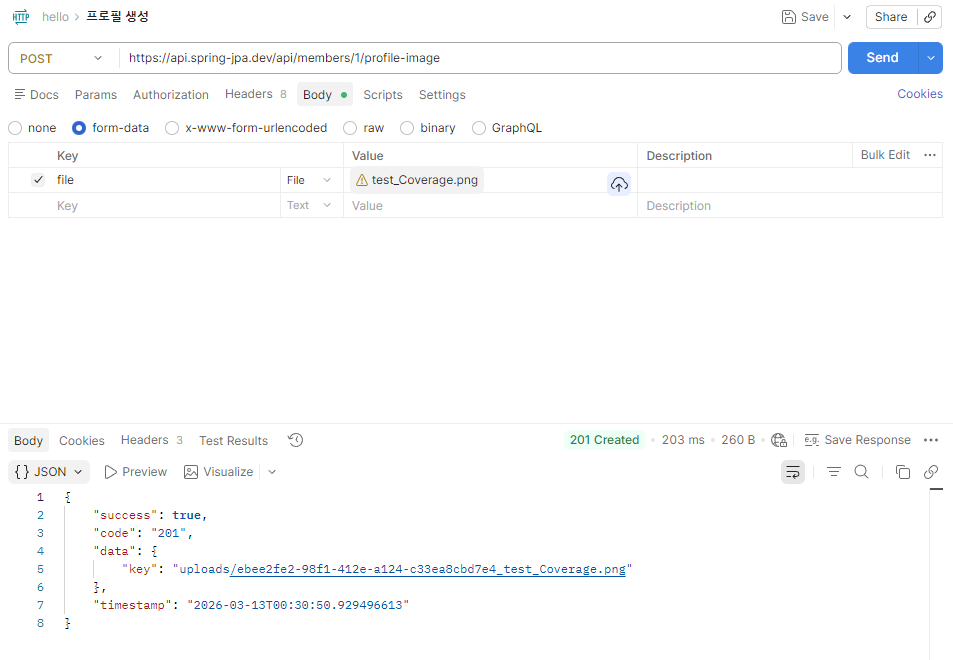
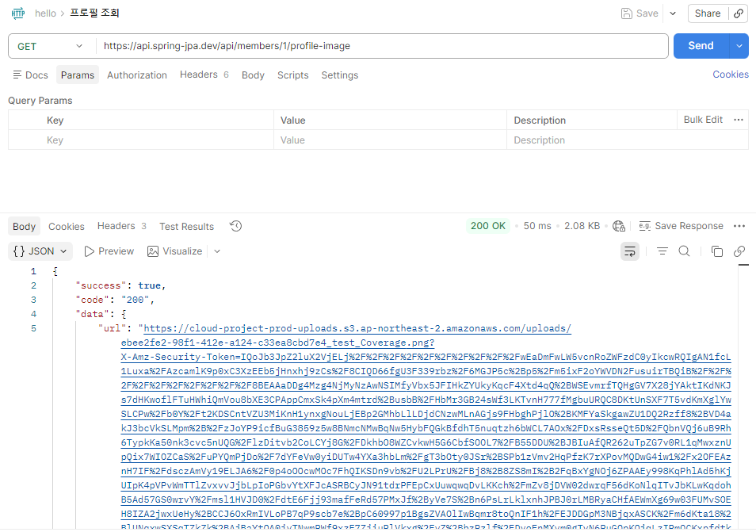
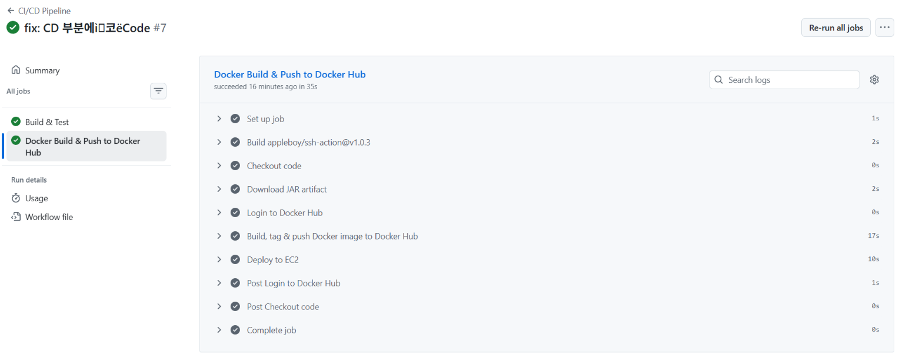
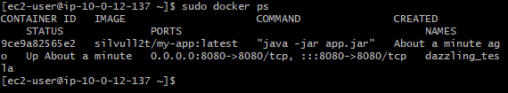
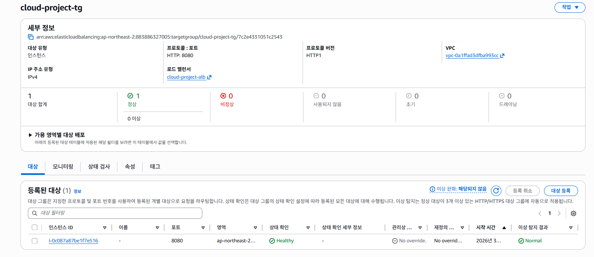

# ☁️ Spring Cloud 과제 - AWS 기반 팀원 소개 서비스

> **"Spring Boot 4.0.3 + AWS 인프라로 구축한 고가용성 팀원 소개 REST API"**  
> 로컬 H2부터 RDS, S3, ALB, Auto Scaling까지 — 운영 수준의 클라우드 아키텍처를 단계별로 구축합니다.

[](https://openjdk.java.net/)
[](https://spring.io/projects/spring-boot)
[](https://awspring.io/)
[](https://www.mysql.com/)
[](https://gradle.org/)
[](https://aws.amazon.com/)

---

## 📖 프로젝트 소개

팀원 정보(이름, 나이, MBTI)와 프로필 사진을 관리하는 **팀원 소개 REST API** 서비스입니다.  
단순한 CRUD를 넘어, **AWS 클라우드 인프라** 위에서 실제 운영 환경과 동일한 수준으로 배포합니다.

### 🎯 주요 구현 목표

| 단계 | 목표 | 핵심 기술 |
|:---:|:---|:---:|
| **LV 0** | 비용 관리 — AWS Budget 알림 설정 | AWS Budgets |
| **LV 1** | VPC 설계, EC2 배포, Actuator 헬스체크 | EC2, Spring Actuator |
| **LV 2** | RDS 분리, 보안 그룹 체이닝, Parameter Store | RDS, AWS SSM |
| **LV 3** | S3 프로필 사진 업로드 / Presigned URL 다운로드 | S3, IAM Role |
| **LV 4** | Docker 컨테이너화 + GitHub Actions CI/CD | Docker, GitHub Actions |
| **LV 5** | ALB + Auto Scaling + HTTPS 도메인 연결 | ALB, ASG, ACM, Route 53 |
| **LV 6** | CloudFront CDN 구축 — S3 Presigned URL → CloudFront URL 전환 | CloudFront, OAC |

---

## 🏗️ 시스템 아키텍처

```
[클라이언트]
     │ HTTPS (443)
     ▼
[Cloudflare DNS] → api.spring-jpa.dev (CNAME → ALB DNS)
     │
     ▼
[ALB - Application Load Balancer]
     │         ├── HTTP(80) → HTTPS(443) 리다이렉트
     │         └── HTTPS(443) → ACM 인증서 적용
     │
     ▼
[Auto Scaling Group]
      └── EC2 (Private Subnet) × N대
           │
           ├── Spring Boot App (Docker)
           │        ├── /api/members                        ← 팀원 CRUD
           │        ├── /api/members/{id}/profile-image     ← S3 업로드/다운로드
           │        ├── /actuator/health                    ← 헬스체크
           │        └── /actuator/info                      ← 팀 정보 (Parameter Store)
           │
           ├── AWS Parameter Store                          ← DB 접속정보, 팀명 등 비밀값 주입
           ├── RDS MySQL (Private Subnet)                   ← 보안 그룹 체이닝으로만 접근
           └── S3 Bucket                                    ← 프로필 이미지 저장 (IAM Role 인증)
```

---

## 🛠️ 기술 스택

| 구분 | 기술 | 버전 및 설명 |
|:---:|:---:|:---|
| **Language** | Java | JDK 17 (LTS) |
| **Framework** | Spring Boot | **4.0.3** — Jakarta EE 기반 |
| **ORM** | Spring Data JPA | Hibernate — H2(local) / MySQL(prod) |
| **Validation** | Jakarta Validation | DTO 레벨 `@Valid` 검증 |
| **Logging** | Spring AOP | `@Around`로 API 요청/응답 자동 로깅 |
| **Monitoring** | Spring Actuator | `health`, `info` 엔드포인트 노출 |
| **Database** | H2 / MySQL 8.0 | 로컬 인메모리 / 운영 RDS |
| **Cloud** | Spring Cloud AWS | **4.0.0** — S3, Parameter Store |
| **Storage** | AWS S3 | 프로필 이미지 저장, Presigned URL |
| **Secret** | AWS Parameter Store | DB 접속정보 / 팀 정보 안전 주입 |
| **Infra** | EC2, RDS, ALB, ASG | VPC Public/Private 서브넷 분리 |
| **Security** | ACM + Cloudflare | HTTPS 인증서 + CNAME으로 도메인 연결 |
| **CI/CD** | GitHub Actions + Docker | 자동 빌드 → DockerHub Push → EC2 배포 |
| **Build** | Gradle | 8.x — Wrapper 포함 |

---

## 🚀 설치 및 실행 가이드

### 1. 사전 준비

- JDK 17 이상 설치 확인
- Gradle (또는 `./gradlew` Wrapper 사용)
- 로컬 실행 시 H2 인메모리 DB를 사용하므로 **별도 DB 설치 불필요**

### 2. 프로젝트 클론

```bash
git clone https://github.com/CheatIsKey/project-cloud.git
cd project-cloud
```

### 3. 프로필별 설정 구조

이 프로젝트는 `local`과 `prod` 두 가지 환경을 분리합니다.

```
src/main/resources/
            ├── application.yml          ← 공통 설정 (포트, Actuator 노출)
            ├── application-local.yml    ← 로컬: H2 DB, 더미 AWS 자격증명
            └── application-prod.yml     ← 운영: MySQL RDS, Parameter Store에서 값 주입
```

**`application-local.yml` 주요 설정 (로컬 실행용):**

```yaml
spring:
  datasource:
    driver-class-name: org.h2.Driver
    url: jdbc:h2:mem:testdb
    username: sa
    password:
  h2:
    console:
      enabled: true   # http://localhost:8080/h2-console 접속 가능

S3_BUCKET_NAME: test-bucket   # 로컬 테스트용 더미값
```

> ⚠️ 운영 환경(`prod`)에서는 DB 접속 정보(`DB_URL`, `DB_USERNAME`, `DB_PASSWORD`),  
> S3 버킷명(`S3_BUCKET_NAME`), 팀 정보(`APP_MESSAGE`, `TEAM-NAME`) 모두  
> **AWS Parameter Store** `/cloud-project-app/prod/` 경로에서 자동으로 주입됩니다.  
> 코드에 비밀값을 직접 입력하지 마세요.

### 4. 로컬 빌드 및 실행

```bash
# Mac / Linux
./gradlew bootRun --args='--spring.profiles.active=local'

# Windows
gradlew.bat bootRun --args='--spring.profiles.active=local'
```

### 5. 동작 확인

```bash
# 헬스체크
curl http://localhost:8080/actuator/health
# → {"status":"UP"}

# 팀원 등록
curl -X POST http://localhost:8080/api/members \
  -H "Content-Type: application/json" \
  -d '{"name":"스파르타","age":25,"mbti":"INTJ"}'
```

---

## 🔌 API 명세

### 📌 팀원 (Member)

| 메서드 | 경로 | 설명 | 요청 Body                                  |
|:---:|:---|:---|:-----------------------------------------|
| `POST` | `/api/members` | 팀원 등록 | `{"name":"스파르타","age":25,"mbti":"INTJ"}` |
| `GET` | `/api/members/{id}` | 팀원 단건 조회 | —                                        |

**응답 예시 (POST /api/members):**
```json
{
  "status": 201,
  "data": {
    "id": 1,
    "name": "스파르타",
    "age": 25,
    "mbti": "INTJ"
  }
}
```

---

### 📌 프로필 사진 (Profile Image)

| 메서드 | 경로 | 설명 | 요청 형식 |
|:---:|:---|:---|:---|
| `POST` | `/api/members/{id}/profile-image` | 프로필 사진 업로드 | `multipart/form-data` (`file` 키) |
| `GET` | `/api/members/{id}/profile-image` | Presigned URL 발급 (유효기간 7일) | — |

**응답 예시 (GET /api/members/{id}/profile-image):**
```json
{
  "status": 200,
  "data": {
    "url": "https://s3.ap-northeast-2.amazonaws.com/bucket/uploads/uuid_filename.jpg?X-Amz-Expires=604800&..."
  }
}
```

---

### 📌 모니터링 (Actuator)

| 경로 | 설명 | 응답 예시 |
|:---|:---|:---|
| `GET /actuator/health` | 서버 상태 확인 | `{"status":"UP"}` |
| `GET /actuator/info` | Parameter Store에서 주입된 팀 정보 | 아래 참고 |

---

## ☁️ AWS 인프라 구성

### LV 0 — AWS Budget 설정 (비용 폭탄 방지)

월 예산 **$100** 설정, **80% 도달 시** 이메일 알림이 발송됩니다.



---

### LV 1 — VPC 네트워크 구성 및 EC2 배포

**VPC 설계:**
- Public Subnet: EC2, NAT Gateway (외부 접근 허용)
- Private Subnet: EC2 (ALB 구성 후), RDS (외부 직접 접근 차단)

**EC2 배포 후 헬스체크 확인:**

- 퍼블릭 IP: `43.201.57.4:8080`
- 엔드포인트: `http://43.201.57.4:8080/actuator/health`



---

### LV 2 — RDS 분리 및 Parameter Store 보안 연결

#### 🔐 RDS 보안 그룹 체이닝

RDS 인바운드 규칙에 **IP 주소 대신 EC2 보안 그룹 ID**만 허용합니다.  
이렇게 하면 EC2를 통해서만 RDS에 접근할 수 있어 외부 직접 접속이 차단됩니다.





#### 🗂️ AWS Parameter Store 연동

DB 접속 정보, S3 버킷명, 팀 이름 등 민감한 설정을 **Parameter Store**에 저장하고,  
Spring Boot 실행 시 자동으로 주입받습니다.

```
/cloud-project-app/prod/
                    ├── DB_URL          → jdbc:mysql://rds-endpoint:3306/dbname
                    ├── DB_USERNAME     → <DB 계정명>
                    ├── DB_PASSWORD     → <DB 비밀번호>
                    ├── S3_BUCKET_NAME  → <S3 버킷명>
                    ├── APP_MESSAGE     → Hello, World!
                    └── TEAM-NAME       → 2조
```

**Actuator Info 확인:** `http://43.201.57.4:8080/actuator/info`

```json
{
  "app": {
    "message": "Hello, World!",
    "team-name": "2조"
  }
}
```

---

### LV 3 — S3 프로필 사진 업로드 / Presigned URL

#### 🔑 IAM Role 방식 (Access Key 미사용)

Access Key를 코드에 하드코딩하지 않고, EC2에 **IAM Role**을 연결합니다.  
EC2 인스턴스가 자동으로 자격증명을 관리하므로 키 유출 위험이 없습니다.

**S3 버킷 설정:**
- "모든 퍼블릭 액세스 차단" ✅
- EC2에 연결된 IAM Role에만 접근 권한 부여

#### 업로드 / Presigned URL 발급 확인

**프로필 사진 업로드 (`POST /api/members/{id}/profile-image`):**



**Presigned URL 발급 (`GET /api/members/{id}/profile-image`):**

> Presigned URL은 **7일간** 유효하며, 해당 URL로만 이미지 다운로드가 가능합니다.  
> URL 만료 후에는 재발급이 필요합니다.



---

### LV 4 — Docker + GitHub Actions CI/CD

#### 🐳 Docker 컨테이너화

`Dockerfile`로 애플리케이션을 이미지로 패키징하여 환경에 관계없이 동일하게 실행됩니다.

**CI/CD 파이프라인 흐름:**

```
개발자 코드 Push (master 브랜치)
        │
        ▼
[GitHub Actions]
  ① Build & Test
  ② Docker 이미지 빌드
  ③ Docker Hub에 Push
        │
        ▼
[EC2 자동 배포]
  ④ docker pull (최신 이미지)
  ⑤ 기존 컨테이너 중지 → 새 컨테이너 실행
```

**GitHub Actions 배포 성공 화면:**



**EC2 실행 컨테이너 확인 (`sudo docker ps`):**



---

### LV 5 — 고가용성 아키텍처 (ALB + ASG + HTTPS)

#### 🌐 HTTPS 도메인

> **[https://api.spring-jpa.dev](https://api.spring-jpa.dev)**

- Cloudflare에서 기보유 도메인 사용
- ACM(AWS Certificate Manager)에서 SSL 인증서 발급
    - Cloudflare DNS에 CNAME 레코드 추가로 도메인 소유권 검증
- Cloudflare DNS에서 CNAME 레코드로 ALB DNS 주소를 연결
- ALB HTTPS(443) 리스너에 인증서 적용
- HTTP(80) → HTTPS(443) 자동 리다이렉트

#### ⚖️ ALB + Auto Scaling Group

- EC2가 **Private Subnet**으로 이동 (외부 직접 접근 차단)
- NAT Gateway를 통해 EC2 → 외부 통신 가능
- ALB가 트래픽을 여러 EC2에 분산
- CPU 사용량 등 지표에 따라 EC2 자동 증설/감소

**Target Group — Healthy 인스턴스 확인:**



---

### LV 6 — CloudFront CDN 구축

#### 🌍 CloudFront 배포 구성

S3 Presigned URL 방식 대신 **CloudFront**를 원본으로 하는 CDN 배포로 전환합니다.  
OAC(Origin Access Control)를 사용해 S3에 직접 접근을 차단하고, CloudFront를 통해서만 이미지를 제공합니다.

**CloudFront 배포 정보:**
- 배포 도메인: `https://dnapymaa2h16i.cloudfront.net`
- 원본(Origin): S3 버킷 (`cloud-project-prod-uploads`)
- 원본 액세스: OAC (Origin Access Control) — S3 퍼블릭 접근 완전 차단

**S3 버킷 정책 (OAC 전용 허용):**
```json
{
  "Statement": [{
    "Effect": "Allow",
    "Principal": { "Service": "cloudfront.amazonaws.com" },
    "Action": "s3:GetObject",
    "Resource": "arn:aws:s3:::cloud-project-prod-uploads/*",
    "Condition": {
      "StringEquals": {
        "AWS:SourceArn": "arn:aws:cloudfront::883886327005:distribution/E2J4X00I7SPBTL"
      }
    }
  }]
}
```

#### 🔄 백엔드 코드 변경 (Presigned URL → CloudFront URL)

기존 S3 Presigned URL 생성 로직을 제거하고, CloudFront 도메인으로 단순 URL 조합 방식으로 변경합니다.

**변경 전 (Presigned URL):**
```
https://cloud-project-prod-uploads.s3.ap-northeast-2.amazonaws.com/uploads/uuid_file.png?X-Amz-...
```

**변경 후 (CloudFront URL):**
```
https://dnapymaa2h16i.cloudfront.net/uploads/uuid_file.png
```

CloudFront 도메인은 AWS Parameter Store `/cloud-project-app/prod/CLOUDFRONT_DOMAIN`에서 주입받습니다.

#### ✅ CloudFront 이미지 URL

> 실제 업로드된 프로필 사진 조회 URL:
```
https://dnapymaa2h16i.cloudfront.net/uploads/ebee2fe2-98f1-412e-a124-c33ea8cbd7e4_test_Coverage.png
```

---


## 🎓 배운 점 및 회고

### 1. 로컬 H2 / 운영 MySQL로 Profile 분리

> **"환경마다 다른 DB를 쓰되, 코드는 하나로"**
>
> 로컬 개발 시 매번 MySQL을 설치·설정하는 번거로움 없이 H2 인메모리 DB를 사용합니다.  
> `spring.profiles.active=<local 또는 prod>` 하나만 바꾸면 DB 설정 전체가 자동으로 전환됩니다.

### 2. Access Key 대신 IAM Role 사용 (S3 접근)

> **"키를 코드에 넣는 순간, 그 키는 이미 유출된 것이다"**
>
> Access Key를 환경변수나 코드에 넣으면 GitHub 실수 유출 등의 위험이 있습니다.  
> EC2에 **IAM Role**을 직접 연결하면, AWS가 임시 자격증명을 자동으로 발급·갱신합니다.  
> 키 관리가 필요 없고, 키 유출 가능성 자체가 사라집니다.

### 3. Parameter Store로 민감 설정 관리

> **"설정파일에 비밀번호를 적는 것은 포스트잇에 비밀번호를 써서 모니터에 붙이는 것과 같다"**
>
> DB 비밀번호, S3 버킷명 등을 AWS Parameter Store에 저장하고 앱 실행 시 주입받습니다.  
> 코드와 설정을 완전히 분리해 보안성을 높이고, 값 변경 시 재배포 없이 적용됩니다.

### 4. Presigned URL 방식의 이미지 다운로드

> **"S3를 퍼블릭으로 열어두면 이미지 도용과 과금 폭탄의 위험이 있다"**
>
> S3 버킷을 완전히 비공개로 유지하면서, 서버가 서명한 **7일 유효 임시 URL**을 발급합니다.  
> 클라이언트는 이 URL로만 이미지를 받을 수 있어 무단 접근이 원천 차단됩니다.

### 5. RDS 보안 그룹 체이닝

> **"DB 포트를 인터넷에 열어두는 것은 금고 문을 활짝 열어두는 것과 같다"**
>
> RDS 인바운드에 IP 대신 EC2 보안 그룹 ID만 허용합니다.  
> 새 EC2가 추가되거나 IP가 변경되어도 자동으로 허용되며,  
> EC2를 통하지 않는 모든 외부 접근은 원천 차단됩니다.

### 6. CloudFront CDN으로 이미지 서빙 최적화

> **"Presigned URL은 매번 새로 발급해야 하고, 만료되면 접근이 불가능하다"**
>
> S3 Presigned URL은 유효기간이 있어 만료 시 재발급이 필요하고, 긴 URL에 인증 파라미터가 노출됩니다.  
> CloudFront를 CDN으로 앞에 두면 URL이 단순해지고, 엣지 캐싱으로 응답 속도도 빨라집니다.  
> OAC 설정으로 S3 버킷은 완전 비공개를 유지하면서 CloudFront를 통해서만 이미지를 안전하게 제공합니다.

---

## 📚 주요 구현 요약

| LV | 구현 항목 | 핵심 기술 | 검증 방법 |
|:---:|:---|:---:|:---|
| 0 | 월 $100 예산 / 80% 알림 | AWS Budgets | 스크린샷 첨부 |
| 1 | VPC, EC2, Actuator 헬스체크 | EC2, Spring Actuator | `GET /actuator/health` → `{"status":"UP"}` |
| 2 | RDS 분리, 보안 그룹 체이닝, Parameter Store | RDS, SSM | `GET /actuator/info` → 팀 이름 출력 |
| 3 | S3 업로드, Presigned URL 발급 | S3, IAM Role | `GET /api/members/{id}/profile-image` |
| 4 | Docker 컨테이너화, GitHub Actions CI/CD | Docker, Actions | 코드 Push → EC2 자동 반영 |
| 5 | ALB + ASG + HTTPS 도메인 | ALB, ACM, Route 53 | `https://api.spring-jpa.dev` 접속 |
| 6 | CloudFront CDN 구축, Presigned URL → CloudFront URL 전환 | CloudFront, OAC | `GET /api/members/{id}/profile-image` → `cloudfront.net` URL 반환 |